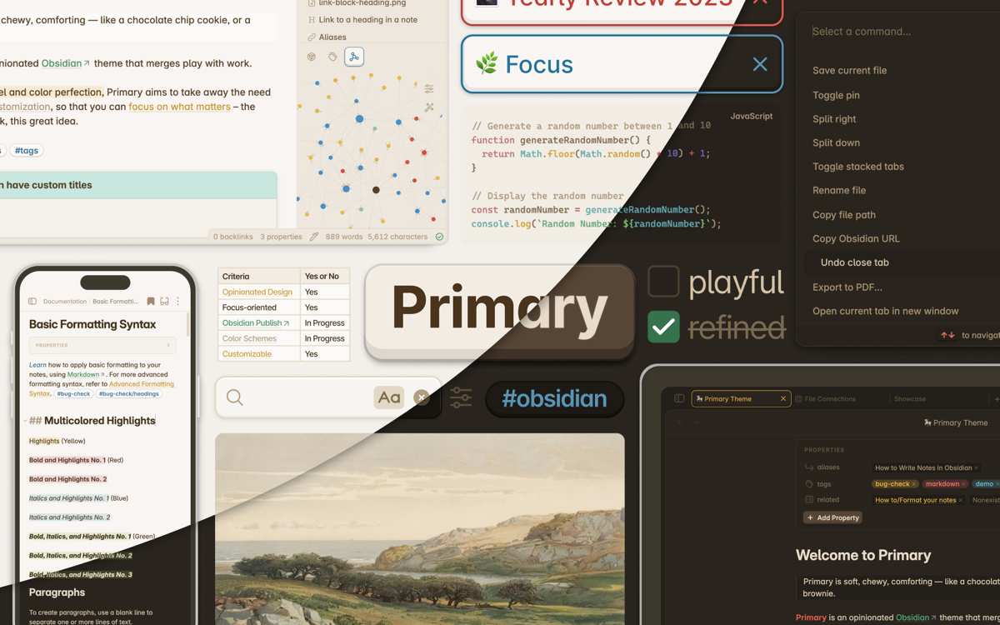
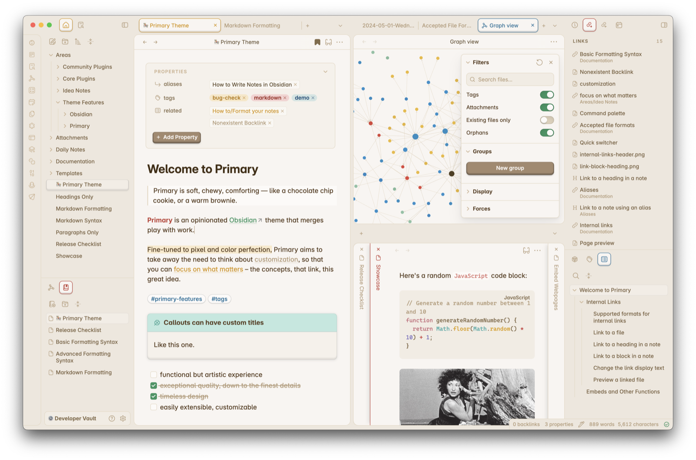
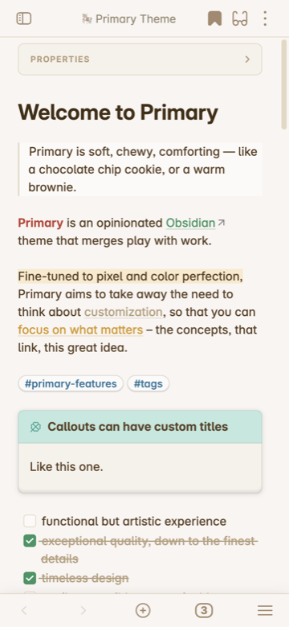
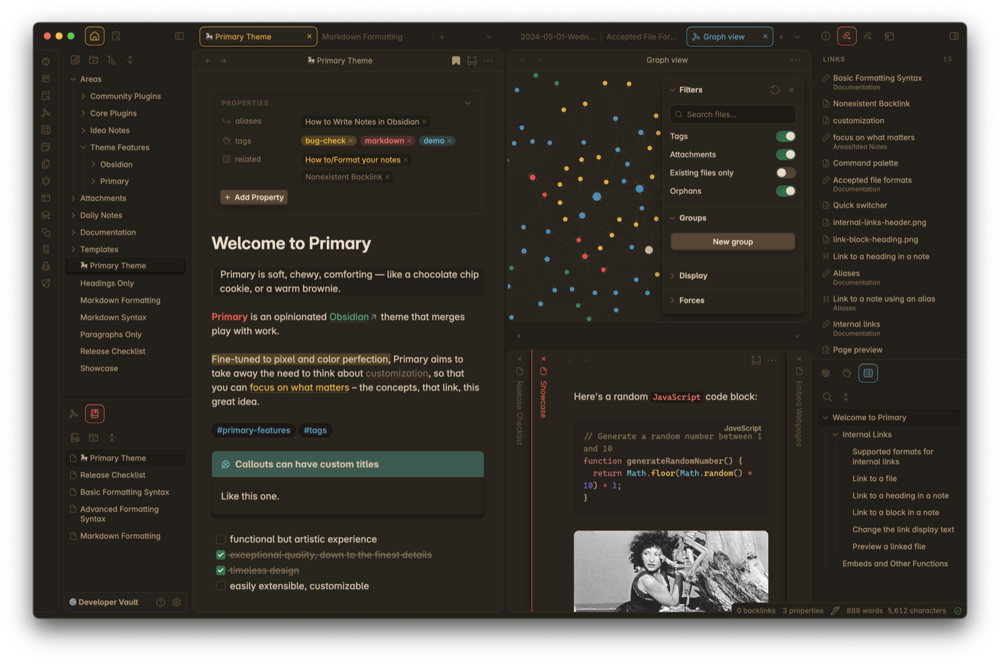
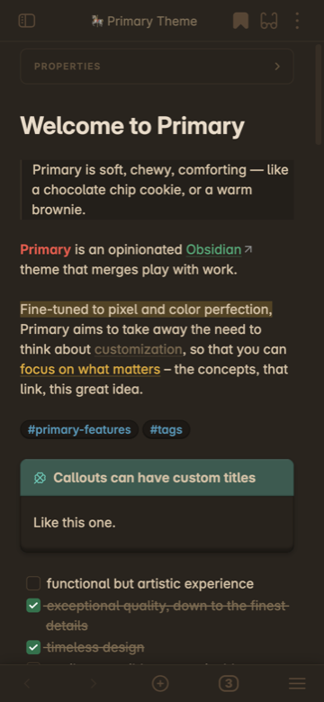

<h1 align="center">Primary Simplified for <a href="https://obsidian.md">Obsidian</a></h1>

<p align="center">
  <a href="./LICENSE"></a>
</p>

Primary Simplified is an independently maintained fork of [Primary](https://github.com/primary-theme/obsidian), originally created by Cecilia May. It keeps Primary's warm, playful visual language while targeting Obsidian 1.13 and newer with a smaller build system, local assets, and a slimmer Style Settings surface.

## Status

Primary Simplified is not currently listed in Obsidian's Community Themes directory.

Obsidian's theme directory policy requires a publicly verifiable approval from the original author, or qualifying evidence that an inactive author could not be reached, before a fork can be submitted. Until that requirement is documented, this theme remains a manual GitHub install.

## Preview

### Light mode



<p align="center">
  
</p>

### Dark mode



<p align="center">
  
</p>

## Install

1. Download [`theme.css`](./theme.css) and [`manifest.json`](./manifest.json) from this repository or from a GitHub release.
2. Create `<vault>/.obsidian/themes/Primary Simplified/`.
3. Copy both files into that folder.
4. Reload Obsidian.
5. Select **Primary Simplified** in **Settings > Appearance > Themes**.

The original **Primary** theme by Cecilia May remains available from Obsidian's Community Themes directory.

## Customization

Primary Simplified intentionally keeps Style Settings focused. Use Obsidian's built-in **Settings > Appearance** controls for:

- interface font
- text font
- monospace font
- accent color
- editor font size

Use the optional Style Settings plugin for theme-specific controls such as motion, popup blur, ribbon and status bar layout, editor background, heading colors, emphasis and link colors, alternative checkboxes, embeds, Canvas, Graph, and colorful folders.

This release removes the previous collapsed legacy section and many low-level color or border controls. Existing saved Style Settings values for removed IDs will no longer apply.

## Design Direction

Primary Simplified is opinionated by default. It does not try to expose every visual token as a setting. The goal is to keep Primary's recognizable warmth and color language while reducing maintenance risk:

- prefer documented Obsidian variables where possible
- keep local fonts and offline assets
- avoid remote resources in `theme.css`
- avoid broad community-plugin skins unless they are deliberately supported
- derive hover and active states from the palette instead of exposing every state as a separate setting

## Development

Primary Simplified is built with Sass and a small Node.js script using Dart Sass.

Prerequisite: a current LTS [Node.js](https://nodejs.org/) release.

```bash
npm install
npm run build
npm test
```

For active development:

```bash
npm run watch
```

The build compiles `src/scss/index.scss`, embeds the local WOFF2 font subsets from `src/fonts`, prepends the license and attribution banner from `src/css/readme.css`, appends Style Settings metadata from `src/css/style-settings.css`, and writes the distributable root [`theme.css`](./theme.css).

Before publishing, run the checks above and complete [`RELEASE_CHECKLIST.md`](./RELEASE_CHECKLIST.md) in a real Obsidian vault.

## Attribution

Primary Simplified is an independent fork and is not affiliated with or endorsed by Cecilia May or the original Primary project.

This fork retains the original copyright and license notices and is distributed under the [GNU General Public License v3.0](./LICENSE). The repository began as an imported snapshot of Primary and does not contain the complete upstream Git history.

If you want to support Cecilia May's original work, visit the original author's [Ko-fi page](https://ko-fi.com/ceciliamay).

## License

Primary Simplified is licensed under the **GNU General Public License v3.0**. See [LICENSE](./LICENSE) for the full license text and [`src/css/readme.css`](./src/css/readme.css) for fork and upstream notices.
